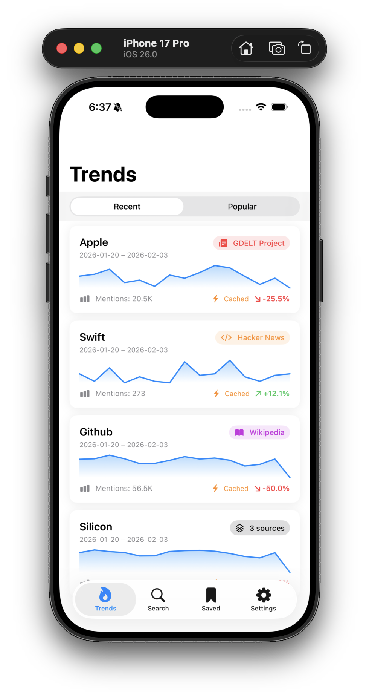
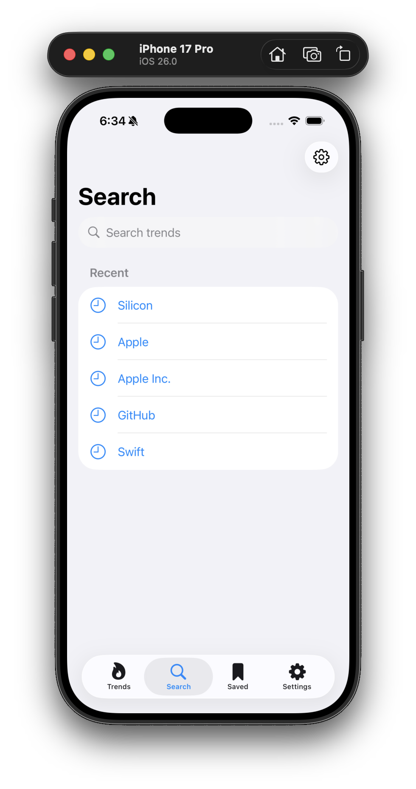

# HypeFlow

iOS app for tracking word trends across multiple sources (Wikipedia, arXiv, news, etc.).




## Requirements

- Xcode 16+
- iOS 18+
- Docker & Docker Compose (for backend)

## Backend Setup

```bash
cd hypeflow-backend
docker-compose up -d
```

This starts:
- **hypeflow** — Spring Boot API (port 8080)
- **mysql** — Database (port 3306)
- **redis** — Cache (port 6379)

API will be available at `http://localhost:8080`

## iOS App

1. Open `hypeflow-ios.xcodeproj` in Xcode
2. Select your target device/simulator
3. Run (⌘R)

The app connects to `localhost:8080` by default. For physical devices, update the API base URL in the app settings or use your machine's local IP.
